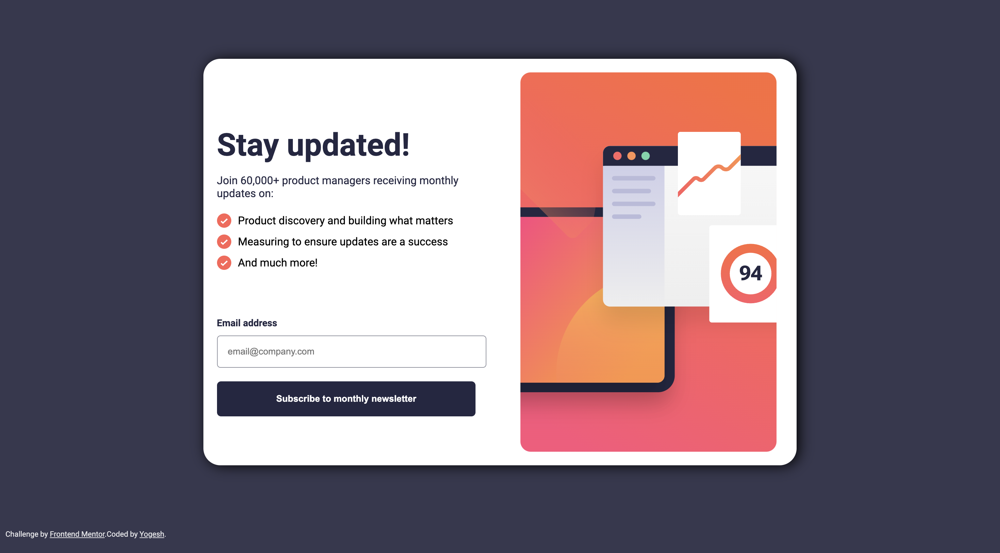
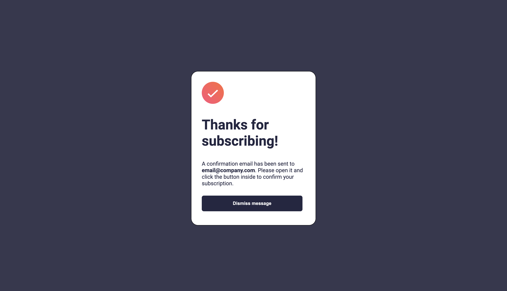

# Newsletter Sign-up Form

This project is a solution to the [Newsletter sign-up form challenge](#challenge-link) on Frontend Mentor. Frontend Mentor provides real-world projects to help you improve your skills as a developer.

## Overview

The challenge is to build a newsletter sign-up form with a success message using HTML, CSS, and JavaScript. The form should include email validation and display a success message when a user subscribes with a valid email.

### Screenshot




### Links

- Live Demo: [Link](https://yogesh0808.github.io/newsletter-signup-frontendmentor/)
- Challenge on Frontend Mentor: [Challenge Link](https://www.frontendmentor.io/challenges/newsletter-signup-form-with-success-message-3FC1AZbNrv)

## Features

- Responsive design for various screen sizes.
- Email validation on the client side.
- Success message display after a successful subscription.
- Dismissal of the success message.

## How to Use

1. Clone the repository:

   ```bash
   git clone https://github.com/yogesh0808/newsletter-signup-frontendmentor.git


## Technologies Used
- HTML
- CSS
- JavaScript


## Acknowledgments
Frontend Mentor for providing the challenge.

## License
This project is licensed under the [MIT License](https://www.frontendmentor.io/).
